<div align="center">

# ☀️ HELIOS PULSE

### *Our star is wide awake — this is the living dashboard for it.*

**Live space-weather · aurora odds · earthquakes · grid risk · AI Oracle — for Solar Cycle 25 maximum (2024 → late 2026)**

[](https://helios-pulse.vercel.app)
[](https://nextjs.org)
[](https://github.com/vasturiano/react-globe.gl)
[](https://ai.google.dev)
[](https://helios-pulse.vercel.app/api/mcp)
[](./LICENSE)
[](./CONTRIBUTING.md)

**No API keys · No signup · Real NOAA + USGS data · MCP-ready for AI agents**

[🔴 Open the live app](https://helios-pulse.vercel.app) · [🛰️ Live room](https://helios-pulse.vercel.app/live) · [🌌 Aurora planner](https://helios-pulse.vercel.app/aurora) · [🤖 Oracle API](#-helios-oracle)

</div>

---

## 🌞 Why now — Solar Maximum 2026

Solar Cycle 25 officially peaked in 2024–2025, but **2026 is still inside the maximum**: elevated auroras, frequent Kp5+ storms, M/X-class flares. Statistically, the *declining phase* right after maximum is when some of the largest individual storms in history struck — including the 1859 Carrington Event.

The same storms that paint the sky can trip power grids, spike satellite drag, degrade GPS and black out HF radio. HELIOS PULSE turns raw NOAA/USGS firehoses into **one beautiful screen anyone can read in 10 seconds** — and an API any agent can use in 10 lines.

---

## 🗺️ How HELIOS works — system architecture

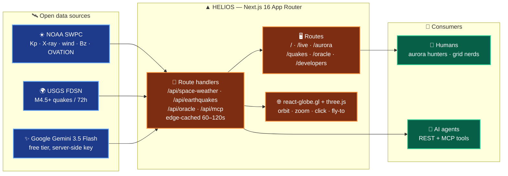

---

## 🔄 Live data pipeline — every 2 minutes

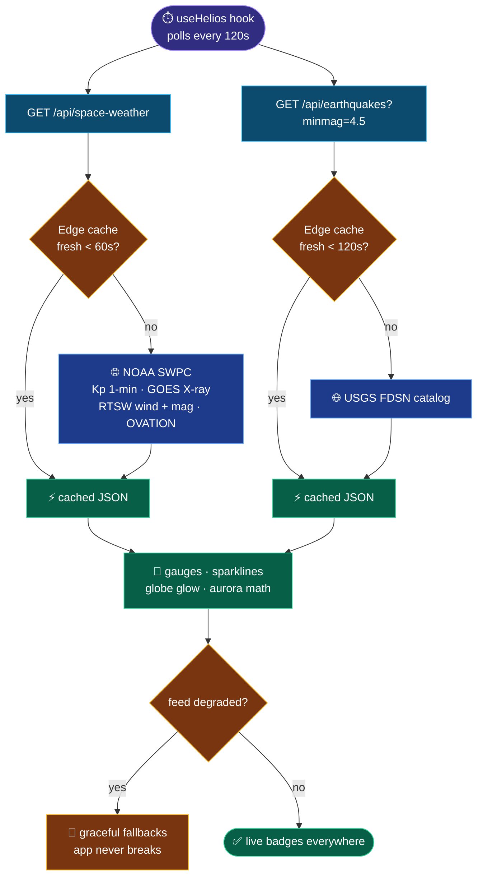

---

## 🧭 Page map — real routes, no hash navigation

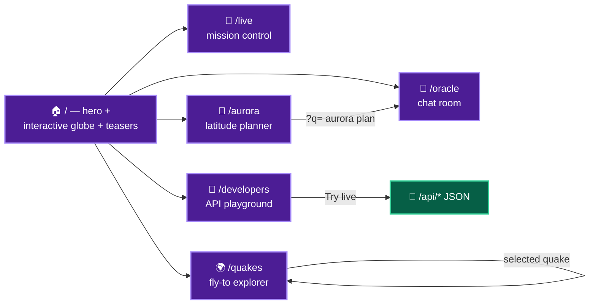

Every link in the nav is a dedicated Next.js route with its own layout, metadata and deep-linkable state.

---

## 🤖 HELIOS Oracle — Gemini brain with physics fallback

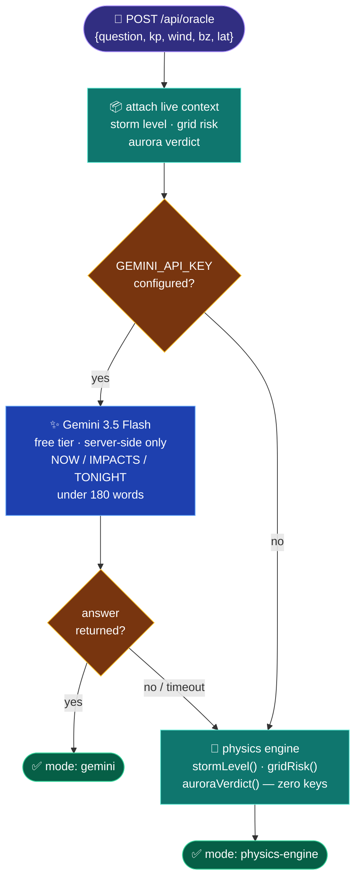

The key lives **only** in the Vercel Production env (Secret) and local `.env.local` (gitignored) — it is never committed, never shipped to the browser.

---

## 🌐 Interactive 3D globe — community-grade, not hand-rolled

Built on **[react-globe.gl](https://github.com/vasturiano/react-globe.gl)** (three.js) with community-standard `three-globe` earth textures (night lights + topology). Orbit controls, clickable magnitude points, expanding selection rings and animated fly-to come from the library — no custom WebGL math.

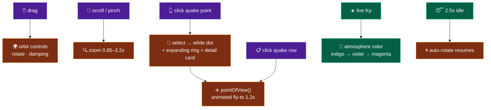

---

## 🧩 MCP — give your agent eyes on the Sun

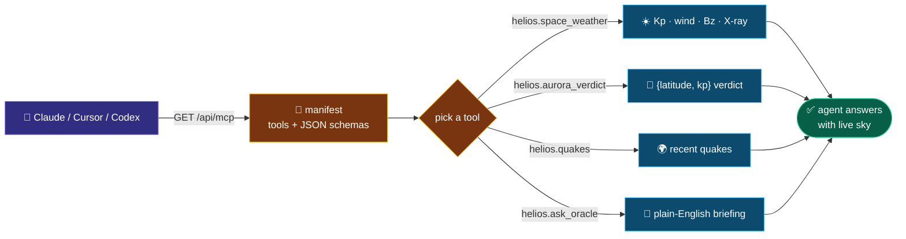

---

## ✨ What you get

| | |
|---|---|
| 🌍 **Interactive 3D globe** | `react-globe.gl` + three.js — orbit, zoom, click-to-select quakes, animated fly-to, storm-reactive atmosphere |
| 🔴 **Live room** (`/live`) | Kp · wind · Bz · X-ray class · grid-stress + per-feed health dots (NOAA SWPC, 60s cache) |
| 📈 **Storm tapes** | 2-hour Kp / wind / Bz sparklines + GOES X-ray flux + OVATION aurora advisories |
| 🌌 **Aurora planner** (`/aurora`) | Latitude slider + presets, 0–100 verdict, oval-edge visual, G-scale decoder |
| 🌍 **Quake explorer** (`/quakes`) | Magnitude filters, rows that fly the globe, USGS detail cards |
| 🤖 **HELIOS Oracle** (`/oracle`) | Gemini 3.5 Flash briefings; physics-engine fallback with zero keys |
| 🧩 **REST + MCP** (`/developers`) | `/api/space-weather` · `/api/earthquakes` · `/api/oracle` · `/api/mcp` — live-try playground |
| ▲ **100% Next.js 16** | App Router routes, Route Handlers, metadata, `sitemap.xml` + `robots.txt` — no plain-React shell |

---

## 🛰️ Data sources (all keyless, all open)

- **NOAA SWPC** — planetary Kp 1-min, GOES X-ray 6h, RTSW solar-wind + mag 1-min, OVATION aurora latest
- **USGS** — FDSN earthquake catalog M4.5+ / 72h
- Proxied + edge-cached by Next.js Route Handlers (`/api/*`) so the UI never CORS-fails and never hammers upstream

## ⌨️ Run locally

```bash
git clone https://github.com/aniruddhaadak80/helios-pulse.git
cd helios-pulse
npm install
npm run dev        # → http://localhost:3000
```

Optional AI upgrade (free tier — key stays server-side, never committed):

```bash
# .env.local (gitignored) — or set GEMINI_API_KEY in Vercel env
GEMINI_API_KEY="your-ai-studio-key"
GEMINI_MODEL="gemini-3.5-flash"
npm run dev
```

Deploy your own in one click:

[](https://vercel.com/new/clone?repository-url=https://github.com/aniruddhaadak80/helios-pulse)

---

## 🗺️ Roadmap — step by step, every phase charted

### ✅ Step 1 — Interactive 3D globe (shipped)

1. Evaluated community 3D globe libraries (cobe → react-globe.gl).
2. Integrated `react-globe.gl` + three.js with night-lights + topology textures.
3. Wired quake points (color/size by magnitude), tooltips, click-select.
4. Added selection rings + `pointOfView` fly-to + idle auto-rotate.

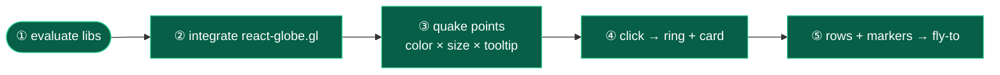

### ✅ Step 2 — Real routes, full Next.js (shipped)

1. Moved every section off hash-anchors onto App Router routes.
2. Shared `SiteNav`/`SiteFooter` chrome + `useHelios` data hook.
3. Deep-linkable state (`/oracle?q=…`), per-route metadata, `sitemap.xml` + `robots.txt`.

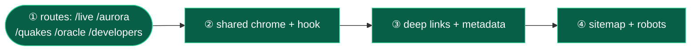

### ✅ Step 3 — Gemini Oracle (shipped)

1. Replaced OpenAI with Gemini 3.5 Flash (free tier, REST + `x-goog-api-key`).
2. Server-side only; physics-engine fallback preserved.
3. Key in Vercel Production secret + gitignored `.env.local`.

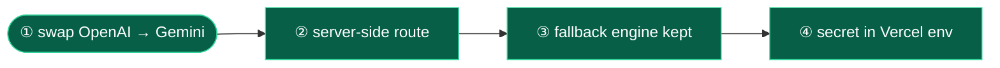

### ✅ Step 4 — Open API + MCP (shipped)

1. Four documented endpoints with edge caching.
2. MCP manifest + dispatcher for Claude/Cursor/Codex.
3. Live-try playground on `/developers`.

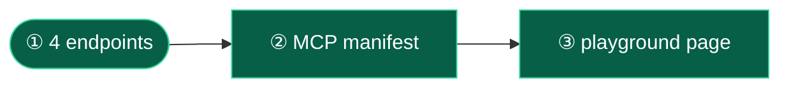

### 🔜 Step 5 — OVATION auroral-oval overlay

1. Parse `ovation_aurora_latest.json` coordinates (65k probability cells).
2. Downsample to a heat-point layer the globe can render at 60fps.
3. Toggle: oval overlay on/off; auto-show when Kp ≥ 5.
4. Legend: probability → color ramp + tonight's edge latitude.

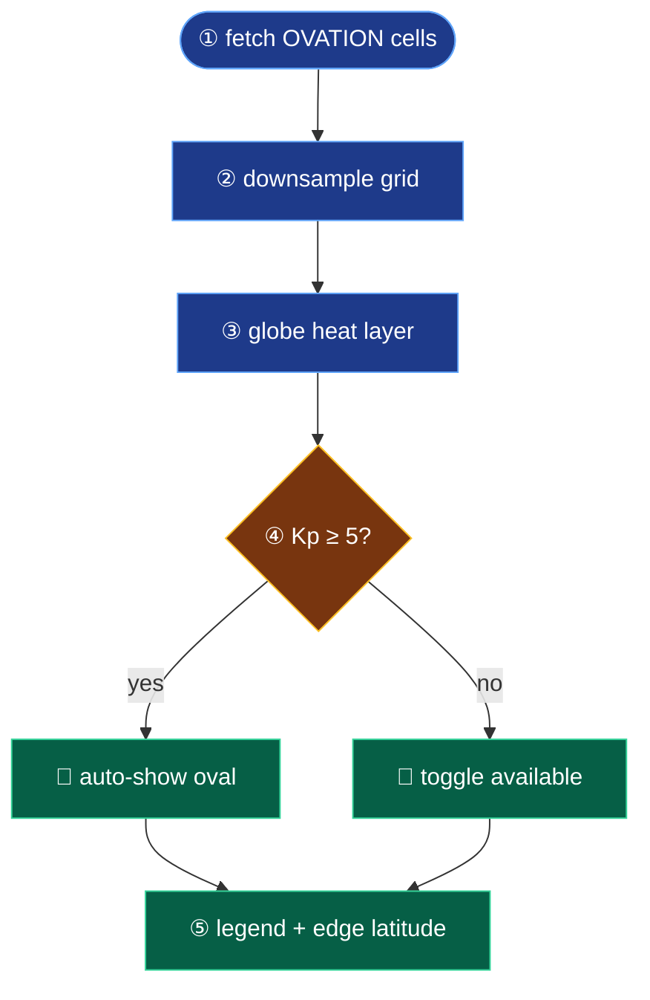

### 🔜 Step 6 — NASA DONKI CME / flare timeline

1. Proxy DONKI CME + SolarFlare endpoints (demo key → user key).
2. Timeline cards: speed, source location, Earth-impact probability.
3. Link CMEs to Kp spikes on the storm tapes.

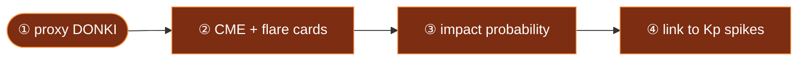

### 🔜 Step 7 — Push alerts for Kp ≥ 6

1. WebPush subscription keyed to user latitude.
2. Server cron checks Kp every 5 min.
3. Push only when oval edge reaches the user's latitude band.
4. Quiet hours + unsubscribe in one tap.

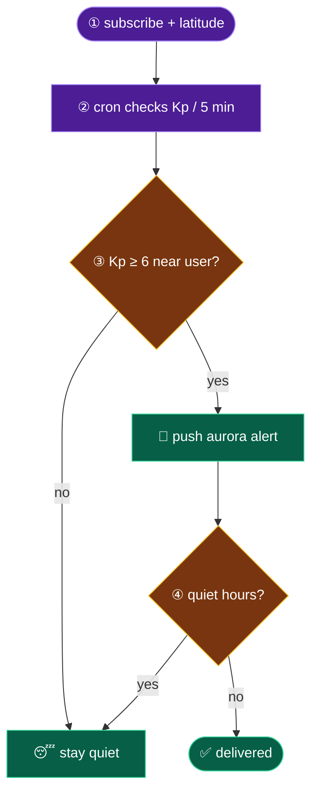

### 🔜 Step 8 — Crowd aurora sightings

1. One-tap "I see it!" with geolocation + photo optional.
2. Server validates against live Kp/oval plausibility.
3. Cluster sightings; render as green dots on the globe.
4. Sightings feed powers "confirmed overhead" badges.

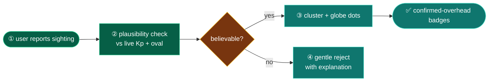

PRs welcome — see [CONTRIBUTING.md](./CONTRIBUTING.md). Good first issues: `aurora-oval`, `donki-timeline`, `webpush`, `og-cards`, `crowd-sightings`.

---

## ⚠️ Honest science

- For life-safety decisions always follow **NOAA SWPC** + local authorities — HELIOS is an educational lens, not an official alert feed.
- Decades of research find **no reliable causal link between solar storms and earthquakes**; we display both so you can watch, not to imply causation.

## 📜 License

MIT © aniruddhaadak80 — the Sun belongs to everyone.

---

<div align="center">

**If HELIOS helped you catch an aurora or dodge a storm — give it a ★ and tell someone under dark skies.** 🌌

</div>
